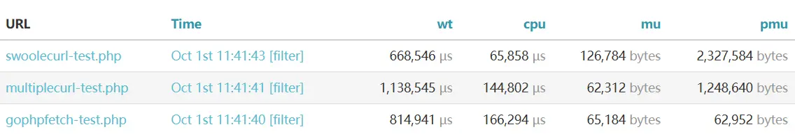

### a php http request extension on concurrence writing in golang

use FFI to call golang http requests with concurrence.

#### install

add follow contents to project's composer.json and run `composer install && composer run-script downloadExtension`.

```json
{
  "require": {
    "fthvgb1/gophpfetch": "*"
  },
  "scripts": {
    "downloadExtension": [
      "@putenv COMPOSER=vendor/fthvgb1/gophpfetch/composer.json",
      "@composer downloadExtension"
    ]
  }
}
```

to avoid including the unnecessary others platform's extension files, you need to download extension file manually
in [release](https://github.com/fthvgb1/gophpfetch/releases).

#### example

```php
$results = Fetch::fetch([
     [
        'url' => 'url',
        'method' => 'get',//default 
        'id' => 'get request',
        'query' => ['query param' => 'values']
    ],
    [
        'url' => 'url',
        'id' => 'post request',
        'body' => ['post body param' => 'values'],
        'header' => [
            'Content-Type' => PostType::FormUrlencoded, //default post type
        ] 
    ],
    [
        'url' => 'download url',
        'method' => 'get',
        'query' => ['query param' => 'value'],
        'id' => 'dowload file',
        'saveFile' => [
            'path' => 'save path',
            'mode' => '0644', //default
            'dirMode '=> '0755' //default
        ]
    ],
    [
        'url' => 'upload url',
        'method' => 'post',
        'id' => 'upload file',
        'header' => ['Content-Type' => PostType::FormData],
        'body' => [
            '__uploadFiles' => [
                'local file' => 'field'
            ]
        ]
    ]
]);

```

#### perform comparison

upload 5 files and download 5 files in a request on concurrence

results:


<table>
    <thead>
        <tr>
            <th></th>
            <th>gophpfetch</th>
            <th>multiple curl</th>
            <th>swoole curl</th>
        </tr>
    </thead>   
    <tbody>
        <tr>
            <td>xdebug</td>
            <td>
            </td>
            <td>
                
            </td>
            <td></td>
        </tr>
        <tr>
            <td rowspan="2">xhprof</td>
            <td colspan="3"></td>
        </tr>
        <tr>
            <td></td>
            <td></td>
            <td></td>
        </tr>
    </tbody>
</table>


test method and scripts [see here](performtestandcomparison/readme.md)

#### reference

[dwdcth/php_golang_ffi](https://github.com/dwdcth/php_golang_ffi)